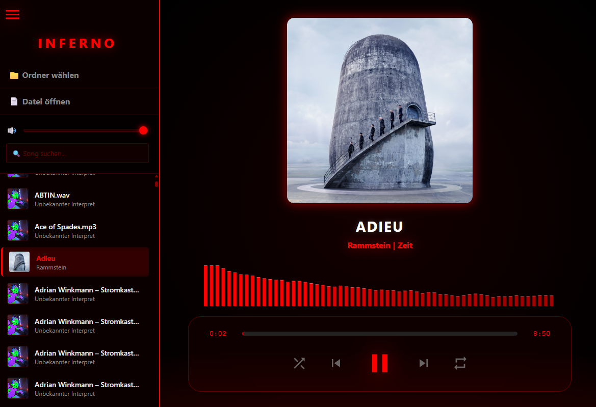

# 🔥 Inferno Media Player

**Inferno Media Player** is a lightweight, modern, and highly customizable desktop media player built with **Python** and **Web Technologies**. It combines the power of a local backend with the styling capabilities of modern CSS3.

It features a sleek dark mode, a real-time audio visualizer, and a dynamic theming engine that allows you to change the look and feel instantly.

---

## 🚀 Key Features

*   **Hybrid Architecture:** Built using `pywebview`, combining Python logic with an HTML/CSS/JS interface.
*   **Media Support:** Plays both **Audio** (MP3, WAV, etc.) and **Video** formats seamlessly.
*   **Real-time Visualizer:** Integrated HTML5 Canvas audio spectrum visualizer.
*   **Smart Playlist:**
    *   Folder scanning.
    *   Instant search filtering.
    *   Single file import.
*   **Advanced Controls:**
    *   Scrubbable progress bar.
    *   Volume control.
    *   Shuffle & Loop modes.
*   **🎨 Dynamic Theme Engine:**
    *   **Live Color Picker:** Change the accent color on the fly.
    *   **CSS Gradients:** The UI automatically calculates gradients and glow effects based on your chosen color.
    *   **Responsive Sidebar:** Collapsible menu with smooth transitions.

---

## 🛠️ Tech Stack

*   **Backend:** Python 3.x
*   **GUI Framework:** [pywebview](https://pywebview.flowrl.com/)
*   **Frontend:** HTML5, CSS3 (Variables, Flexbox, Gradients), Vanilla JavaScript
*   **Audio API:** Web Audio API (for the visualizer)

---

## 📦 Installation & Usage

### 1. Prerequisites
Ensure you have Python installed. You will need the `pywebview` library.

```bash
pip install pywebview
# Optional: Depending on your OS, you might need a specific renderer
# pip install pywebview[qt]  # For Qt (recommended)
# pip install pywebview[cef] # For CEF
```

### 2. Project Structure
Ensure your folder looks like this:

```text
/InfernoPlayer
│
├── main.py          # The Python entry point (Backend logic)
├── index.html       # The main GUI structure
├── style.css        # Styling and Theme variables
└── mainframe.js     # Frontend logic and Audio Context
```

### 3. Run the Application
Execute the Python script to start the player:

```bash
python main.py
```

---

## 🎨 Customization

The player includes a built-in **Theme Picker** in the sidebar.

1.  Open the Sidebar (Hamburger menu).
2.  Locate the **"Theme Farbe"** (Theme Color) input.
3.  Select any color.
4.  The application will instantly update:
    *   Glow effects.
    *   Background gradients.
    *   Sidebar borders.
    *   Visualizer bars.

---

## 📸 Screenshots



---

## 📜 License

This project is open-source. Feel free to modify, distribute, and use it as you wish.

---

**Created with 🔥 by cosyfluf