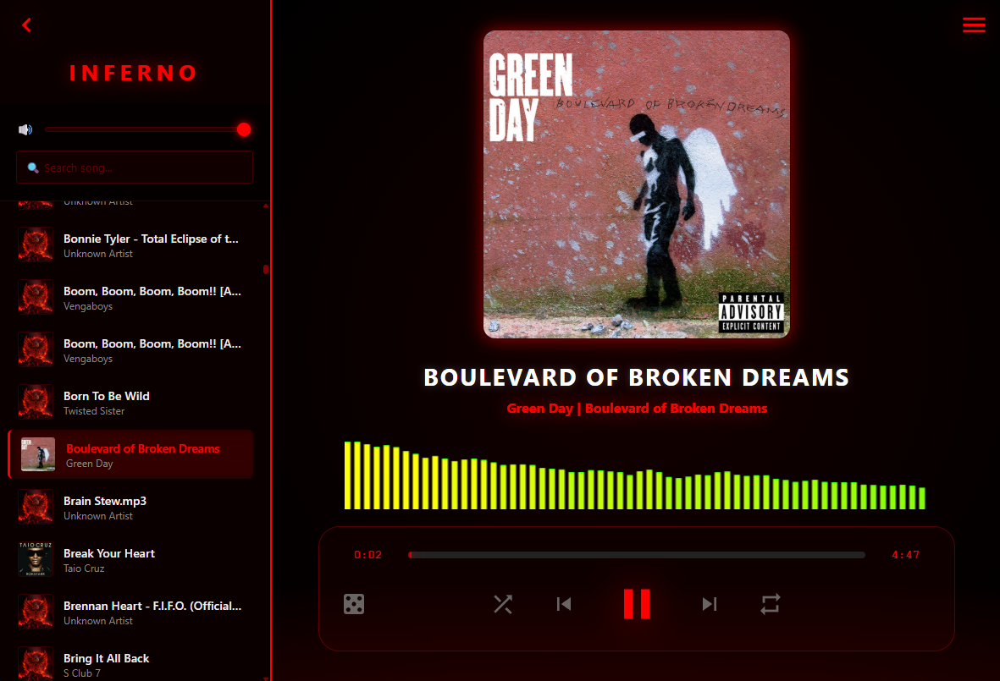

# 🔥 Inferno Media Player


**Inferno Media Player** is a lightweight, modern, and highly customizable desktop media player built with **Python** and **Web Technologies**. It combines the robust backend capabilities of Python with the sleek styling of modern CSS3 and JavaScript.

The player features an aggressive "Inferno" dark theme, a real-time audio visualizer, and a dynamic theme engine that allows you to change the entire UI accent color on the fly.

---

## 🚀 Key Features

*   **Hybrid Architecture:** Powered by `pywebview`, bridging an HTML5/CSS3/JS frontend with a Python logic backend.
*   **Multi-Format Support:** Seamlessly plays both **Audio** (MP3, WAV, OGG) and **Video** (MP4, WEBM) files.
*   **Real-time Visualizer:** Integrated HTML5 Canvas audio spectrum visualizer that reacts dynamically to frequency data.
*   **Smart Library Management:**
    *   **Folder Scanning:** Automatically scans directories for media and extracts metadata.
    *   **Single File Import:** Quickly open individual files directly via the system file explorer.
    *   **Instant Search:** Filter your playlist by song title or artist in real-time.
*   **Advanced Playback Controls:**
    *   **Draggable Progress Bar:** Click or drag to scrub through tracks accurately.
    *   **Metadata Extraction:** Displays album art, titles, and artist info using `mutagen`.
    *   **Shuffle & Loop:** Standard toggle modes for personalized listening.
*   **🎨 Dynamic Theme Engine:**
    *   **Live Color Picker:** Change the accent color (default: Red) via the menu.
    *   **Adaptive UI:** Watch as glow effects, progress bars, visualizer colors, and buttons instantly adapt to your chosen color.
*   **Persistent Settings:** Saves your default music folder automatically in a `config.json` file.

---

## 🛠️ Tech Stack

*   **Backend:** Python 3.x
*   **Library:** [pywebview](https://pywebview.flowrl.com/) for the GUI.
*   **Metadata:** [mutagen](https://github.com/quodlibet/mutagen) for reading ID3 tags and covers.
*   **Frontend:** HTML5, CSS3 (Flexbox, CSS Variables), Vanilla JavaScript.
*   **Server:** Python's `http.server` with range-request support (crucial for video scrubbing).

---

## 📦 Installation & Usage

### 1. Prerequisites
Ensure you have Python installed. You will need the following libraries:

```bash
pip install pywebview mutagen
```

*Note: Depending on your OS, `pywebview` might require a specific renderer (like `QT` or `CEF`). Check the pywebview documentation for details.*

### 2. Project Structure
Ensure your directory is organized as follows:

```text
/InfernoPlayer
│
├── main.py          # Python Backend & API
├── index.html       # UI Structure
├── style.css        # Styling & Theme Variables
├── mainframe.js     # Logic & Audio Context
└── config.json      # (Auto-generated) Stores user settings
```

### 3. Run the Application
Launch the player by running:

```bash
python main.py
```

---

## Screenshots



## 🎨 Customization

Access the **Sidebar Menu** (Hamburger icon in the top right) to:
1.  **Toggle Visualizer:** Enable or disable the spectrum bars.
2.  **Theme Color:** Select any color to completely change the look of the player.
3.  **Choose Folder:** Set a new permanent directory for your media library.

---

## 📜 License

This project is licensed under the MIT License.

---

**Created with 🔥 by cosyfluf**
