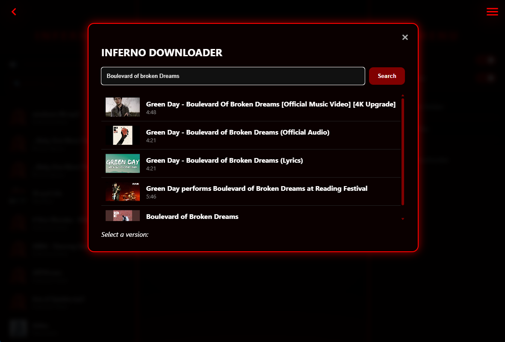

# 🔥 Inferno Media Player


**Inferno Media Player** is a lightweight, modern, and high-performance desktop media player built with **Python** and **Web Technologies**. It combines a sleek "Inferno" dark aesthetic with powerful playback and downloading capabilities.

The player features a real-time audio visualizer, seamless video support, and an integrated YouTube-to-MP3 downloader that uses Spotify metadata to provide high-quality album art and track information.

---

## 📸 Screenshots

| Main Player Interface | Song Downloader (Detailed Mode) |
| :---: | :---: |
|  |  | |
| *Visualizer and Playlist* | *Search and Spotify metadata enrichment* |*Discord rich presence* |


---

## 🚀 Key Features

*   **Hybrid Architecture:** Powered by `pywebview`, bridging an HTML5/CSS3/JS frontend with a Python backend.
*   **Discord Rich Presence:** Show your friends what you're listening to! Integrates with Discord to display track titles, artists, and even album covers in real-time.
*   **Multi-Format Support:** Plays **Audio** (MP3, WAV, OGG) and **Video** (MP4, WEBM) files.
*   **Real-time Visualizer:** Integrated HTML5 Canvas spectrum visualizer reacting to audio frequency data.
*   **Smart Library Management:**
    *   **Folder Scanning:** Automatically scans directories and extracts metadata.
    *   **Instant Search:** Filter your playlist by title or artist in real-time.
*   **Integrated YouTube Downloader:**
    *   **Normal Mode:** Fast YouTube-to-MP3 conversion.
    *   **Detailed Mode:** Uses the **Spotify API** to fetch official album covers, artist names, and album titles to tag your files perfectly.
*   **Advanced Playback Controls:** Draggable progress bar for precise scrubbing, shuffle, loop, and volume controls.
*   **Persistent Settings:** Saves your music folder, API credentials, and Discord settings in a `config.json` file.

---

## 🛠️ Tech Stack

*   **Backend:** Python 3.10+
*   **Downloader Engine:** `yt-dlp` (YouTube) & `spotipy` (Spotify API).
*   **Presence:** `pypresence` for Discord Rich Presence integration.
*   **Metadata:** `mutagen` for ID3 tagging and cover embedding.
*   **Frontend:** HTML5, CSS3, Vanilla JavaScript.
*   **Server:** Internal Python range-request server for media streaming/scrubbing.

---

## ⚙️ Configuration (Spotify & Discord)

To use the **"Detailed Version"** in the downloader and enable Discord Rich Presence with covers, you should provide your credentials in the `config.json`.

1.  **Spotify:** Visit the [Spotify Developer Dashboard](https://developer.spotify.com/dashboard) to get a **Client ID** and **Client Secret**.
2.  **Discord:** The application uses a default Client ID (`1471223610315247616`) for the Inferno Media Player presence.
3.  Create/Edit `config.json` in the root folder:

### `config.json` Example:
```json
{
    "default_path": "C:\\Users\\Name\\Music",
    "spotify_client_id": "your-spotify-client-id",
    "spotify_client_secret": "your-spotify-client-secret",
    "discord_client_id": "1471223610315247616"
}
```
> **Note:** On Windows, ensure you use double backslashes (`\\`) for the folder path.

---

## 📦 Installation & Usage

### 1. Prerequisites
Ensure you have **FFmpeg** installed on your system (required for MP3 conversion). Install the Python dependencies:

```bash
pip install pywebview yt-dlp spotipy mutagen requests pypresence
```

### 2. Run the Application
Launch the player by running:

```bash
python main.py
```

---

## 📜 License

This project is licensed under the MIT License.

---

**Created with 🔥 by cosyfluf**
